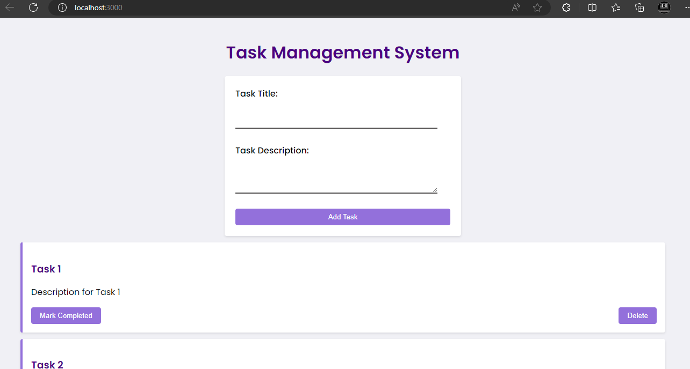

# FunFox-Program-React-Developer-Coding-Test
[](https://opensource.org/licenses/MIT)


## Description
FunFox-Program-React-Developer-Coding-Test project is a web-based task management system that allows multiple users to collaborate within the same group. Create and manage tasks effortlessly with this user-friendly application. Add tasks with titles and descriptions, mark them as complete or incomplete, and easily delete them when needed. Enjoy a smooth and responsive user experience on desktop, tablet, and mobile devices. Stay organized and boost productivity with Project Name!

## Installation
To get started with FunFox-Program-React-Developer-Coding-Test project, follow these simple steps:

1. Clone the repository:

```
git clone https://github.com/Maimoona-Qasmi-3/FunFox-Program-React-Developer-Coding-Test
```

2. Navigate to the project directory:

```
cd FunFox-Program-React-Developer-Coding-Test
```

3. Install dependencies:

```
npm install
```

## Usage
After completing the installation, run the following command to start the application:

```
npm start
```

Access the application in your web browser at http://localhost:3000. Create tasks, mark them as complete, and manage your to-do list with ease!

## Features
- User-friendly task creation form with title and description fields.
- Mark tasks as complete or incomplete for easy tracking.
- Effortlessly delete tasks from the list.
- Smooth and responsive design, optimized for various devices.
- **Task 4: API Integration and Data Sharing**
  - Integrate the task management system with a mock API that supports data sharing between users in the same group.
  - Each user should be part of a specific group, and upon login, they should only see tasks from other users within the same group.
  - Allow users to add tasks that will be visible to others in the same group.
  - Ensure that the state management allows for real-time updates when a user adds, completes, or deletes a task.

## Technologies
- React.js
- Node.js
- HTML5
- CSS3


## Website


## Contact
If you have any questions or feedback, feel free to reach out:

- GitHub: Maimoona Qasmi(https://github.com/Maimoona-Qasmi-3)
- Email: maimoonaqasmi3@gmail.com
